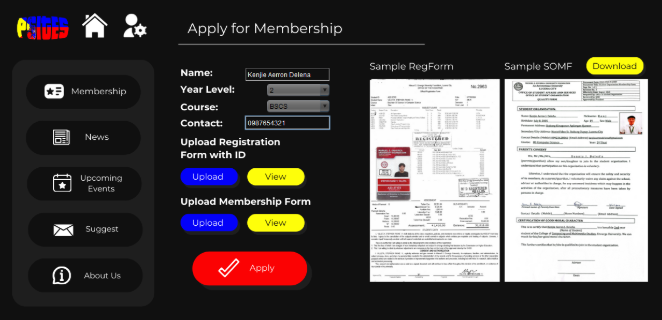
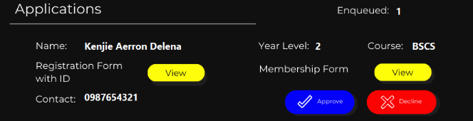
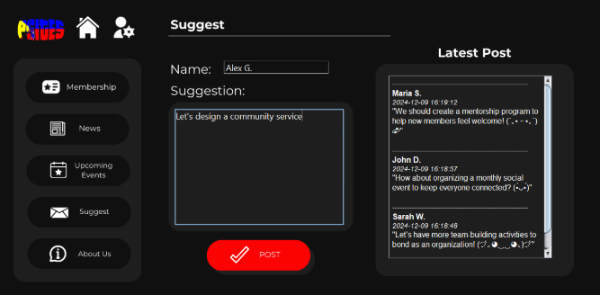
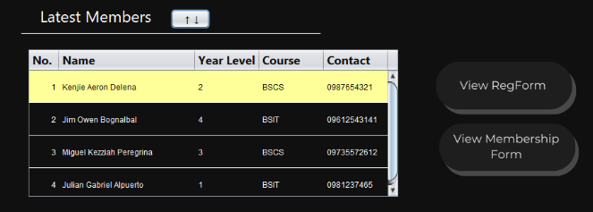

# PSITES Membership Application and Communication System

## Overview
This project is a Java-based application designed to streamline the membership application and communication processes for the Philippine Society of Information Technology Students (PSITES). The system leverages data structures such as linked lists, queues, and stacks to manage member registrations, optimize communication workflows, and enhance document management. 



## Features
- **Membership Management**: Handles member applications using a queue for processing and a stack for approved members.
- **Suggestion System**: Allows users to submit suggestions, which are managed using a stack to prioritize the latest feedback.
- **Tabbed Interface**: Includes tabs for Home, Membership, Admin, News, Events, Suggest, and About Us.

## Data Structures
- **Queue**: Used for managing the order of membership applications.

- **Stack**: Used for managing approved members and user suggestions.

- **Linked List**: Provides dynamic handling of member records.


## How to Run
1. Ensure you have Java installed on your system.
2. Clone the repository.
3. Navigate to the project directory.
4. Build the project using Maven:
    ```sh
    mvn clean install
    ```
5. Run the application:
    ```sh
    java -cp target/PSITES-1.0-SNAPSHOT.jar com.mycompany.psites.PSITES
    ```

## Dependencies
- `org.netbeans.external:AbsoluteLayout:RELEASE230`
